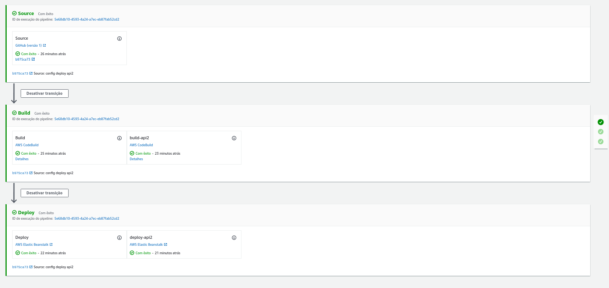

# Property and Meter Price

Two API's that return property price and meter price.

This api contains:

- Unit and integration tests;
- Log system;
- Based on clean architecture;
- Documentation
    [API1](https://infinite-shelf-03720.herokuapp.com/doc/#/Meters/get_meters_price)
    [API2](https://nameless-bayou-05586.herokuapp.com/doc/#/Properties/get_properties_price)
- Docker;

## How to run the project with docker

1) Run in the root project `sudo docker-compose up` to initialize the container.

2) Run the comand bellow in your terminal:
```json
  curl -H "Content-Type: application/json" -X GET "http://localhost:8080/api/properties/price?quantity=10"
```

## How to run tests

Run `npm run test` to execute all(unit and integrations) tests of the api.

## Architecture

### API1

```bash
├── src
│   ├── api
│   │   ├── meters
│   │   │   ├── use-case
│   │   │   │   ├── get-meter-price
│   │   │   │   │   ├── get-meter-price.js
│   │   │   │   │   ├── index.js
│   │   │   │   │   ├── get-meter-price.test.js
│   │   │   │   ├── index.js
│   │   │   ├── index.js
│   │   │   ├── routes.js
│   │   │   ├── controller.js
│   ├── index.js
│   ├── core
│   │   ├── config
│   │   │   ├── express
│   │   │   │   ├── index.js
│   │   ├── services
│   │   │   ├── log
│   │   │   │   ├── index.js
│   │   │   │   ├── logger.js
│   │   │   ├── middleware
│   │   │   │   ├── log
│   │   │   │   │   ├── index.js
│   │   │   ├── response
│   │   │   │   ├── index.js
│   │   │   ├── serializers
│   │   │   │   ├── errors.js
│   │   │   │   ├── index.js
├── app.js
├── config.js
├── index.js
├── __tests__
│   ├── integrations
│   │   ├── meters
│   │   │   ├── get-meter-price.test.js
```

### API2

```bash
├── src
│   ├── api
│   │   ├── properties
│   │   │   ├── use-case
│   │   │   │   ├── get-property-price
│   │   │   │   │   ├── get-property-price.js
│   │   │   │   │   ├── index.js
│   │   │   │   │   ├── get-property-price.test.js
│   │   │   │   ├── index.js
│   │   │   ├── index.js
│   │   │   ├── routes.js
│   │   │   ├── controller.js
│   ├── index.js
│   ├── core
│   │   ├── config
│   │   │   ├── express
│   │   │   │   ├── index.js
│   │   ├── services
│   │   │   ├── log
│   │   │   │   ├── index.js
│   │   │   │   ├── logger.js
│   │   │   ├── middleware
│   │   │   │   ├── log
│   │   │   │   │   ├── index.js
│   │   │   ├── response
│   │   │   │   ├── index.js
│   │   │   ├── serializers
│   │   │   │   ├── errors.js
│   │   │   │   ├── index.js
├── app.js
├── config.js
├── index.js
├── __tests__
│   ├── integrations
│   │   ├── properties
│   │   │   ├── get-property-price.test.js
```

## Main Dependencies

- express: Web framework.
- jest and supertest: Unit test and integration test.
- Swagger: To create documentation for this API.
- winston and stack-trace: To create logs for this API.

## Access API's

### HEROKU
- [API1](https://infinite-shelf-03720.herokuapp.com/api/meters/price)
- [API2](https://nameless-bayou-05586.herokuapp.com/api/properties/price?quantity=10)

### AWS
- [API1](http://api1-env.eba-3t2yz5e6.us-east-2.elasticbeanstalk.com/api/meters/price)
- [API2](http://api2-env.eba-pjqypnx7.us-east-2.elasticbeanstalk.com/api/properties/price?quantity=10)

## CI/CD

- Github actions
- AWS CodePipeline

